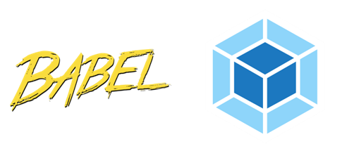

<!-- class: slide1 -->

# webpackとbabel使って環境構築をしたので得た知見を共有する
## 冨田優斗
---
<!-- class: slide2 -->
# そもそもWebpackって何？

オープンソースのJavaScriptモジュールバンドラーです

### モジュールバンドラーって？
複数のモジュール(機能ごとに分割されたファイル)を1つにまとめたファイルを出力することです

### webpackを使うと何がいいの？
- １つのファイルにまとめるため、読み込みが早くなる
- モジュールを分割できるため、保守性が高くなる

---

# babelってなに？
<!-- class: slide3 -->
オープンソースのJavaScriptトランスコンパイラです

ソースコードをES2015形式に変換します

babelを使うと、新しく出来上がった文法を使って書いたコードをES2015形式に変換してくれるので、古いブラウザでも動作をさせることができます

### トランスコンパイラって？
> １つのプログラミング言語で書かれたプログラムのソースコードを別のプログラミング言語の同等のソースコードを生成するコンパイラである
wikiより

---
# 実際にバベってバンドルしてみる

---

# まとめ
- webpackは複数あるjavascriptのファイルを1つにまとめてくれる(バンドル)すごいやつ

- babelはJavaScriptのより新しい書き方を過去の古いブラウザでも実行できるような形に変換してくれるすごいやつ

- おそらくですが、1からちゃんと自力で環境構築するよりもフレームワークを使うのならば`vue create`やら`react-create-app`を使うのが一番安全で簡単だと思いました

なぜかES2020に追加されたオプショナルチェイングがつかえない！？といった場面があったとして、真っ先にbabelのバージョンが原因か！？と疑うことができますし、
webpack系のエラーが起きた際には、もしかしたらどこか`import`していないファイルがあるのではないかと疑うことができるため、知らないに越したことはないのかなあというのが自分が出した結論です

---
# 最後に
- 今回のLTの資料
	- https://github.com/yuto-tomita/front-end-lt-slide
	   (最近はVSCodeでMarkdownでスライドが書けますgit管理できます便利)

- サンプルで動かしたコードのリポジトリ
	- https://github.com/yuto-tomita/example-webpack-babel

 
---
# ご清聴ありがとうございました！！

